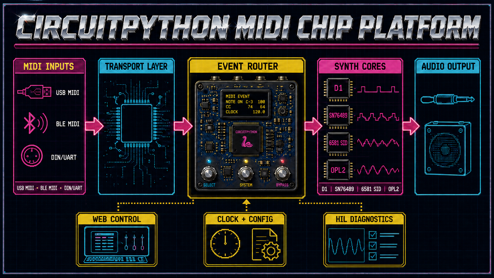

# CircuitPython MIDI Chip Platform

> ’n MIDI-beheerde, multi-kern retro-sintetiseerdermodule in pedaalvorm, met USB-MIDI, stereo-klankuitvoer, plaaslike webbeheer en uitbreibare skyfie-emulasie.



Die seinpad bly doelbewus modulêr: USB-MIDI, BLE-MIDI en DIN/UART word na een draagbare eventmodel genormaliseer; die router kies ’n kerninstansie; die klankpoort kies MAX98357-I2S, PWM-diagnose of ’n latere stereo-backend. Die kernpad is **D1-basiskern → SN76489 → 6581 SID → OPL2 → OPL3**.

## Projekstatus

Die projek is by **Sprint 2: MIDI en clock**, runtime **v0.11.1**. Draagbare events, USB-MIDI receive-loop, BLE-capability gating, kanaalroetering, note-off en pitch bend/CC1 is host-groen. Die Wemos S2 het die dependency-geslote HIL geslaag: autoreload-safe 16-lêer deploy, `adafruit_midi`, harde boot, clean imports en execution. USB Note On/Off bly die volgende menslike stimulus; daar is nog geen synth core of geaktiveerde klank-, BLE- of Wi-Fi-diens nie.

## Begin hier

Die [snelbegin- en installasiegids](docs/quickstart_installation_v0.1.0.md) neem 'n beginner stap vir stap deur Git, Python, 'n virtuele omgewing, installasie, diagnose en toetse op macOS, Windows en Raspberry Pi. VS Code en Thonny is opsionele hulpmiddels; die projek is nie van enige IDE afhanklik nie.

Nadat die installasie voltooi is:

```bash
python -m midi_chip_platform diagnose
python -m pytest
```

## MVP in een sin

Bewys op ’n LOLIN/Wemos ESP32-S2 Mini dat ’n gebruiker via klawerbord of MIDI-kitaar note, akkoorde, bends en slides kan stuur, eers ’n draagbare D1-basiskern en daarna ’n SN76489-agtige driestem-kern kan speel, mono MAX98357-klank en later stereo-uitvoer kan gebruik, en kernparameters op ’n eenvoudige plaaslike webblad kan verander. BLE-MIDI word op ’n tweede BLE-geskikte CircuitPython-bord aanvaar omdat die ESP32-S2 self nie native BLE ondersteun nie.

## Webtoegang

Die synth probeer tydens runtime ’n privaat gekonfigureerde Wi-Fi-netwerk join en rapporteer daarna sy station-IP. Indien die netwerk ontbreek of die begrensde join-poging misluk, begin die synth ’n beveiligde eie access point en rapporteer sy AP-IP. Die mobiele webblad werk in albei modusse, beperk die MVP tot een aktiewe kliënt en skryf geen logreël vir elke poll of UI-verversing nie. Wi-Fi begin nooit in `boot.py` nie.

## Hoekom ’n skoon repository?

Die bestaande `pappavis/midi-chip-platform` bevat waardevolle idees, dokumentasie en ’n ou modulêre CircuitPython-basislyn, maar ook verskillende runtime-generasies. Hierdie repository hergebruik die getoetste kontrakte en leerlesse sonder om historiese eksperimente as produksiekode te behandel.

## Lees eerste

- [MVP-omvang](docs/mvp_scope_v0.1.0.md)
- [Volledige user-story-katalogus](docs/user_stories_v0.1.0.md)
- [Toestel- en broninventaris](docs/mcp_us_001_device_source_baseline_inventory_v0.1.0.md)
- [Hergebruiksmatriks](docs/reuse_matrix_v0.1.0.md)
- [Span en RACI](docs/team_raci_v0.1.0.md)
- [Risiko-register](docs/risk_register_v0.1.0.md)
- [Bronregister](docs/source_register_v0.1.0.md)
- [Excel Kanban-backlog](outputs/CHATOD-20260714-MCP-CP-MVP-001/circuitpython_midi_chip_platform_mvp_kanban_v0.1.0.xlsx)
- [Agile delivery- en releaseplan](docs/agile_delivery_release_plan_v0.1.0.md)
- [Backlog sanity check](docs/backlog_sanity_check_v0.1.0.md)
- [Afdwingbare agent- en kodereels](AGENTS.md)
- [Snelbegin, installasie en ontwikkelomgewings](docs/quickstart_installation_v0.1.0.md)
- [MCP-US-002 review en toetsbewys](docs/mcp_us_002_project_skeleton_review_v0.1.0.md)
- [MCP-US-003 safe-boot review en HIL-bewys](docs/mcp_us_003_safe_boot_review_v0.1.0.md)
- [MCP-US-004 bordvermoëns-review en bedrading](docs/mcp_us_004_board_capability_review_v0.1.0.md)
- [MCP-US-005 konfigurasie- en geheimegrens-review](docs/mcp_us_005_configuration_secret_boundary_review_v0.1.0.md)
- [MCP-US-006 draagbare MIDI-eventmodel-review](docs/mcp_us_006_portable_event_model_review_v0.1.0.md)
- [MCP-US-007 USB-MIDI receive-loop-review](docs/mcp_us_007_usb_midi_receive_review_v0.1.0.md)
- [MCP-US-062 BLE-MIDI capability-review](docs/mcp_us_062_ble_midi_capability_review_v0.1.0.md)
- [MCP-US-008 MIDI-kanaalrouter-review](docs/mcp_us_008_midi_channel_router_review_v0.1.0.md)
- [MCP-US-009 note-off-semantiek-review](docs/mcp_us_009_note_semantics_review_v0.1.0.md)
- [MCP-US-010 pitch bend/CC1-review](docs/mcp_us_010_pitch_bend_cc1_review_v0.1.0.md)
- [Outonome MIDI-batch hostaanvaarding en toestelverbinding](docs/autonomous_midi_batch_host_acceptance_v0.1.0.md)
- [Sprint 1 lessons learned - checkpoint 001](docs/lessons_learned_sprint_1_checkpoint_001_v0.1.0.md)
- [Sprint 2 lessons learned - checkpoint 001](docs/lessons_learned_sprint_2_checkpoint_001_v0.1.0.md)
- [Sprint 2 lessons learned - dependency-closed deployment](docs/lessons_learned_sprint_2_checkpoint_002_v0.1.0.md)
- [MCP-US-051 HIL-runner review](docs/mcp_us_051_hil_runner_review_v0.1.0.md)
- [MCP-US-051/007 dependency-closed deployment-impediment](docs/mcp_us_051_mcp_us_007_dependency_closed_deployment_impediment_v0.1.0.md)
- [Audio-prioriteit en MIDI-kitaar amendment](docs/audio_priority_amendment_v0.1.0.md)
- [MIDI-transport en multi-core amendment](docs/midi_transport_multicore_amendment_v0.1.0.md)
- [BLE-MIDI en synth-core-prioriteit](docs/ble_midi_core_priority_amendment_v0.1.0.md)
- [Wi-Fi station-, access-point- en mobiele webfallback](docs/wifi_runtime_fallback_amendment_v0.1.0.md)
- [Device Connection Proof](docs/device_connection_proof_v0.1.0.md)

## Belangrike veiligheidsreëls

- Wi-Fi-wagwoorde, API-sleutels en plaaslike toestelidentifiseerders word nooit in Git gestoor nie.
- `settings.toml`, `secrets.py`, firmwarebeelde en private toestelrugsteune word deur `.gitignore` uitgesluit.
- ’n Wagwoord wat voorheen in prototipekode verskyn het, moet geroteer word voordat netwerkwerk begin.
- Geen UF2-flash, skyfuitvee of bootloader-aksie gebeur sonder ’n afsonderlike, eksplisiete goedkeuring nie.

## Ontwikkelbeginsels

- Klasgebaseerde ontwerp sonder globale toepassingsstatus.
- Geen globale veranderlikes, `global`-statements, modulevlak helperfunksies of import-newe-effekte nie.
- Alle runtime-status behoort aan klasinstansies en word via dependency injection gekoppel.
- Klein stories met rooi/groen-toetse en eksplisiete hardeware-aanvaarding.
- Bordvermoëns word ontdek; bordname, MIDI-toestelle en penne word nie as universele konstantes aanvaar nie.
- MIDI, kernlogika, klankuitvoer en webbeheer word deur duidelike poorte geskei.
- Die klankenjin bly vervangbaar: draagbare D1-basiskern eerste, SN76489 tweede, 6581 SID derde en OPL2/OPL3 daarna.
- BLE-MIDI is ’n MVP-vereiste, maar word capability-gated: die ESP32-S2 rapporteer dit veilig as nie-ondersteun; ’n BLE-geskikte tweede bord lewer die fisiese aanvaardingsbewys.
- Wi-Fi-runtime gebruik ’n eksplisiete toestandmasjien: station join, begrensde mislukking, beveiligde AP-fallback en sigbare IP; logging is spaarsaam en koersbegrens.
- Die span volg backlogvolgorde; side quests word georden en nie stilweg geimplementeer nie.
- Lessons learned word na elke drie of vier voltooide stories en by epic-/releasegrense opgedateer.
- `python-d1-synth` is produksiekode en word uitsluitlik as 'n leesalleen-verwysing gebruik.
- Ollama is opsioneel vir goedgekeurde klein ontwikkeltake; dit is nooit nodig om die synth te bou of uit te voer nie.
- Startup toon altyd projekweergawe, aktiewe story/amendment en release-datum.

## Lisensie

MIT. Sien [LICENSE](LICENSE).
