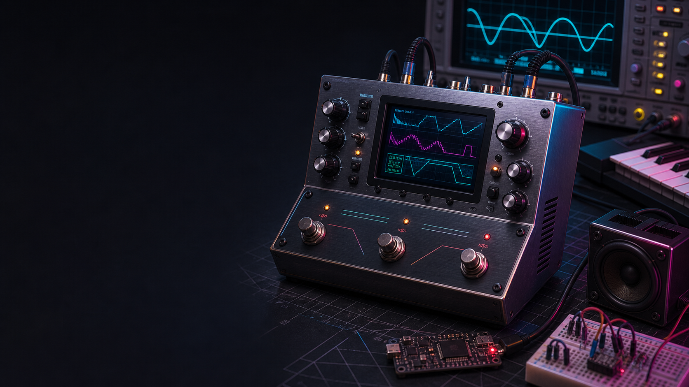

# Onafhanklike QA-audit: CircuitPython MIDI Chip Platform

Bestand: `external_qa_audit_report_v0.1.0.md`
Versienommer: 0.1.0
Doel: Onafhanklike produk-, kode-, argitektuur-, QA-, sekuriteits- en Agile-oudit
Auditdatum: 2026-07-15
Geouditeerde commit: `a4ba993`
ChatID: `CHATOD-20260714-MCP-CP-MVP-001 / EXTERNAL-QA-AUDIT-001`
Status: Advies vir Product Owner-hersiening; geen backlog- of kodeverandering is hierdeur goedgekeur nie

> **Bewysgrens:** Die beeld hierbo is 'n gegenereerde konsepvisualisering vir kommunikasie. Dit is nie 'n foto van gelewerde hardeware en nie HIL-bewys nie.

## 1. Uitvoerende gevolgtrekking

Die CircuitPython MIDI Chip Platform is tans 'n besonder goed gedokumenteerde en doelbewus bestuurde ontwikkelingsprojek, maar nog nie 'n werkende synthesizerproduk nie. Die repository toon sterk produkdenke, noukeurige naspeurbaarheid, 'n waardevolle klasgebaseerde skeiding van verantwoordelikhede en eerlike onderskeid tussen hosttoetse en fisiese toestelbewys. Dit is aansienlik beter as die gemiddelde eksperiment waar prototipekode, hardewareaannames en produkbeloftes sonder beheer saamgroei.

Die belangrikste onafhanklike QA-oordeel is egter dat die projek se **governance-volwassenheid veel hoër as sy produkvolwassenheid** is. Weergawe `0.11.0`, 68 groen hosttoetse, 63 user stories en 33 Markdown-dokumente wek maklik die indruk van 'n gevorderde implementering. Die huidige `device/code.py` begin in werklikheid net capability- en konfigurasiediagnose. Dit instansieer nog nie die USB-MIDI ontvangslus, note-semantiek, performance state, router, synth core of audio-uitvoer nie. Geen synth core bestaan nie en geen huidige release lewer klank nie. Die README erken dit korrek; die release- en presentasiesemantiek behoort dieselfde realiteit nog sterker te weerspieël.

Die mees dringende tegniese bevinding is 'n defek in die HIL-deploymanifest. Die manifest kopieer modules wat `ports.py` en `core.py` invoer, maar kopieer nie daardie afhanklikhede nie. Die bestaande HIL-toets vergelyk slegs voorafgeskepte bron-/device-hashes en toets nie dependency closure of invoerbaarheid op CircuitPython nie. Daarom kan die runner vier groen bewysreëls lewer vir 'n pakket wat by die eerste werklike MIDI-import faal. Dit is 'n **P0 release-proof-defek**, nie bloot 'n toekomstige verbetering nie.

Die tweede dringende probleem is scope. Die MVP bevat tegelyk USB-MIDI, BLE-MIDI op 'n tweede bord, DIN/UART, D1 en SN76489, stereo, web station/AP, 'n virtuele keyboard, sequencer, DSP, guitar-MIDI, multi-core runtime, installasie, Windows/macOS-aanvaarding en herstel. Dit is 'n produkroadmap, nie 'n minimale MVP nie. Die korrekte volgende mylpaal is 'n kleiner **Early Audible Increment**: herstel die deployketting, voeg die minimale AudioOutput-kontrak by, bewys een veilige MAX98357-toon op die werklike S2, en verbind daarna USB Note On/Off deur die D1-basiskern na mono-I2S.

Die audit beveel dus 'n gekontroleerde koerskorreksie aan, nie 'n herskryf nie. Die bestaande poorte, eventmodel, bordprofiel en veilige boot is bruikbare fondasie. Die span moet eers die vertikale runtime saamstel en meet voordat web, BLE, multi-core of chipakkuraatheid momentum kry.

## 2. Auditmandaat en metode

Die audit is uitgevoer as 'n kombinasie van eksterne QA-review, argitektuurassessering, Agile-retrospektief, produk-risikoanalise en release-governance-oudit. Die doel was om bewerings te probeer falsifiseer, nie om die projek te bemark nie. Positiewe bevindinge word behou waar bronkode, toetse of gedokumenteerde HIL-bewys hulle ondersteun. Aannames en voorstelle word apart van geverifieerde feite gehou.

Die volgende materiaal is ondersoek:

- die volledige geversioneerde repository by commit `a4ba993`;
- 19 Python-modules onder `src`, twee device-entrypoints en 15 testmodules;
- 33 Markdown-dokumente, drie ADR's, README, AGENTS en die Excel-Kanban;
- Git-geskiedenis en file churn oor 18 commits;
- die 63-story katalogus en status-/afhanklikheidsinligting;
- huidige en historiese HIL-bewysdokumente;
- die eksterne Copilot-audit as adviserend bronmateriaal;
- amptelike CircuitPython-, Adafruit MIDI-, BLE- en MAX98357-dokumentasie;
- die Product Owner se gerapporteerde hosttoetsresultate.

Die volgende verifikasies is self uitgevoer:

- `68 passed` met Python 3.12.13;
- bron- en testkompilasie met die eksplisiete Python 3.12-interpreter;
- `ruff check` oor `src`, `device` en `tests`, met geen bevindinge nie;
- geheime- en plaaslike-padskandering oor die huidige checkout;
- beperkte Git-geskiedenisskandering vir die bekende prototipecredential;
- AST-gebaseerde ontleding van die HIL-manifest se plaaslike importafhanklikhede;
- volledigheidskontrole dat MCP-US-001 tot MCP-US-063 in Markdown voorkom;
- status- en dokumentdriftkontrole;
- inspeksie van installasiegedrag teen die werklike host waar `python` na Python 2.7 wys en Python 3.12 eksplisiet gekies moet word.

Hierdie audit het nie 'n nuwe firmwaredeploy, luidsprekertoets, Logic Pro-toets, BLE-advertensie, Windows-toets of lang duurtoets uitgevoer nie. Sulke gedrag word dus nie as geslaag verklaar nie. Die vorige device proof vir ouer commits word as historiese bewys aanvaar, maar bewys nie dat die huidige `v0.11.0`-manifest uitvoerbaar is nie.

## 3. Onafhanklike maturity-scorekaart

Die telling meet huidige bewys, nie entoesiasme of toekomstige potensiaal nie.

| Gebied | Telling | QA-oordeel | Kernrede |
|---|---:|---|---|
| Produkvisie en doelgroep | 8.5/10 | Sterk | Duidelike pedal-/MIDI-gebruik, kernvolgorde en verwysingshardeware |
| Dokumentasie en naspeurbaarheid | 8.5/10 | Sterk | ChatID, story, weergawe, ADR's, reviews en lessons learned is sigbaar |
| Kode-organisasie | 7.0/10 | Goed, onvolledig | Poorte en dependency injection is bruikbaar; runtimekomposisie ontbreek |
| Host-eenheidstoetse | 7.0/10 | Goed vir huidige eenhede | 68 vinnige groen toetse; geen coverage-, mutation- of property-meting |
| Device/HIL-betroubaarheid | 3.5/10 | Onvoldoende | Historiese proof bestaan, maar huidige manifest is nie dependency-gesluit nie |
| MIDI-implementasie | 4.5/10 | Fondasie | Events, vertaling en state bestaan; geen huidige end-to-end devicepad nie |
| Audio-implementasie | 1.0/10 | Nie gelewer nie | Geen AudioOutput-backend, bufferloop, D1-kern of hoorbare release nie |
| Sekuriteit en privaatheidsgrens | 6.5/10 | Redelik | Goeie redaksie en ignore-reëls; credentialrotasie en toekomstige websekuriteit oop |
| Portabiliteit en release engineering | 3.5/10 | Vroeg | Een bordprofiel, geen CI-matriks, geen library lock, geen Windows/Linux-bewys |
| Scope- en Agile-beheer | 5.5/10 | Gemeng | Sterk prosesreëls, maar MVP bevat te veel produklyne en dokumentdrift bestaan |
| **Algehele produkvolwassenheid** | **4.6/10** | **Below MVP** | Sterk fondasie en beheer; nog geen hoorbare vertikale produkinkrement nie |

Hierdie telling is doelbewus laer as die Copilot-oordeel van 8.4/10. Copilot het die kwaliteit van visie en governance korrek raakgesien, maar het dokumentasievolwassenheid te sterk as produkvolwassenheid geïnterpreteer. 'n Synthesizer sonder 'n aktiewe synth- of audiopad kan nie as 8.4/10 produkvolwasse geklassifiseer word nie, selfs wanneer sy beplanning uitstekend is.

## 4. Wat aantoonbaar goed werk

### 4.1 Eerlike statuskommunikasie

Die sterkste kwaliteitseienskap is nie 'n spesifieke klas nie, maar die herhaalde onderskeid tussen hostgroen, deviceproof en hoorbare aanvaarding. Die README sê uitdruklik dat daar nog geen synth core en geen geaktiveerde audio-, MIDI-receive-, BLE- of Wi-Fi-diens op die toestel is nie. MCP-US-010 bly `In Review (host accepted)` omdat die hoorbare bend eers ná I2S en D1 bewys kan word. MCP-US-062 erken die S2 as 'n negatiewe BLE-toets en maak nie 'n positiewe claim sonder 'n geskikte tweede bord nie. Hierdie dissipline verminder ernstige hallucinasie- en release-risiko.

### 4.2 Importveilige, instansiegebaseerde ontwerp

Die bronmodules het geen modulevlak runtime-toekennings of globale diensinstansies nie. `ruff` slaag en die AST-argitektuurtoetse dwing die verbod op globale state, modulevlak helperfunksies en import-side effects af. Vir hierdie projek is die hoofdoel geldig: die MIDI-, kern-, audio- en weblae moet later deur verskillende entrypoints saamgestel kan word sonder dat 'n import USB, radio of klank begin.

Die skeiding tussen `MidiInputPort`, `AudioOutputPort`, `ClockPort`, `ConfigurationPort` en `SynthCore` is klein en verstaanbaar. `CoreRegistry` besit kanaaltoewysing per instansie. `MidiMessageTranslator` verberg die Adafruit-boodskapklasse agter draagbare events. Die ontwerp maak hostfakes moontlik sonder om CircuitPython op die host na te boots.

### 4.3 Veilige bootbesluit

Die huidige `boot.py` het geen Wi-Fi-, audio- of synthruntime nie. Dit stel slegs USB-identiteit, HID-beleid en USB-MIDI op. Dit pas by CircuitPython se bootmodel en verminder die kans dat 'n fout in netwerk- of businesslogika die device onnodig moeilik herstelbaar maak. Die besluit om VID/PID nie te oorskryf nie is verstandig vir 'n ontwikkelrelease. Die historiese bewys dat USB MIDI descriptors en `usb_midi.ports` op die S2 verskyn het, is waardevol.

### 4.4 Bordvermoëns en hardewareveiligheid

Die Lolin S2-profiel is eksplisiet en die IO5/IO3/IO7-toewysing word as profieldata behandel. Die runtime ontdek of `audiobusio`, `audiopwmio`, `synthio`, `usb_midi` en `wifi` werklik bestaan. Onbekende borde kry geen stil I2S-aanname nie. Die MAX98357 ADR waarsku korrek dat die luidsprekeruitgang bridge-tied is, nie na grond of 'n line-input mag gaan nie, en dat 'n MAX98357 nie die finale pedal-line-out verteenwoordig nie.

### 4.5 MIDI-domeinfondasie

Die eventmodel valideer kanale en waardereekse, gebruik `__slots__` en vermy onnodige CPython-swaar konstrukte. USB en BLE kan dieselfde vertaler gebruik. Pitch bend en CC1 word per kanaal gestoor, wat noodsaaklik is vir MPE-agtige of guitar-MIDI-gedrag waar verskillende snare op verskillende kanale kan bend. Die S2 se gebrek aan native BLE is volgens amptelike CircuitPython-dokumentasie korrek gegate.

### 4.6 Repository- en geheimedissipline

`settings.toml`, `secrets.py`, firmwarebeelde, private backups en gegenereerde caches word geïgnoreer. Die huidige checkout bevat geen bekende werklike SSID, wagwoord, token, plaaslike serial-ID of hardgekodeerde `/Users`-/`/Volumes`-pad in geversioneerde produkmateriaal nie. Konfigurasieverslae wys slegs `SET` of `UNSET` vir private waardes. Die ou prototipecredential is nie in die huidige Git-geskiedenis gevind nie; dit is nogtans korrek om rotasie as mensaksie oop te hou indien dit ooit aktief was.

## 5. Kritieke bevindinge

### P0-01: Die HIL-deploymanifest is nie dependency-gesluit nie

`HilDeploymentManifest.default()` deploy twaalf pakketmodules plus `boot.py` en `code.py`. Die modules `configuration.py`, `midi_usb.py` en `ble_midi.py` voer `midi_chip_platform.ports` in. `routing.py` voer `midi_chip_platform.core` in. Nie `ports.py` of `core.py` is in die manifest nie.

Die bestaande HIL-toets skep vir elke manifestinskrywing 'n kunsmatige bronlêer en 'n identiese devicelêer, vergelyk hashes en laat die serial probe 'n voorafbepaalde banner teruggee. Dit probeer nooit die gedeployde modules invoer of hul plaaslike afhanklikhede ontleed nie. Die runner kan dus `deployment: PASS` en `execution: PASS` rapporteer omdat `device/code.py` slegs release-, capability- en configurationmodules gebruik, terwyl `midi_usb.py` later op die device met `ImportError` sou faal.

**Impak:** Die huidige MCP-US-051-bewysmodel kan 'n vals groen releasesein lewer. MCP-US-007 se fisiese Note On/Off-aanvaarding is nie uitvoerbaar met die huidige manifest nie.

**Aanbeveling:** Maak hierdie 'n impediment teen MCP-US-051/MCP-US-007. Voeg `ports.py` en `core.py` by die manifest, skep 'n dependency-closure-toets wat AST-imports of 'n eksplisiete device-package-manifest valideer, en voer 'n werklike device-import smoke test uit voordat die volgende funksionele story begin.

### P0-02: Device library-afhanklikhede is nie reproduceerbaar nie

`CircuitPythonUsbMidiFactory` importeer `adafruit_midi` en sy message modules dinamies. Die amptelike Adafruit-dokumentasie vereis dat die library en afhanklikhede op die CircuitPython-filesystem beskikbaar is, gewoonlik via die Adafruit bundle. Die repository het geen `requirements.txt`/bundle manifest, geen `circup`-stap, geen vasgepende libraryweergawe en geen HIL-kontrole dat `adafruit_midi` op `CIRCUITPY/lib` bestaan nie.

**Impak:** 'n Skoon installasie kan boot en diagnose groen toon maar by eerste USB-MIDI runtime-import faal. 'n Ontwikkelaar kan toevallig 'n ou library op sy bord hê, waardeur 'n nie-reproduceerbare sukses ontstaan.

**Aanbeveling:** Definieer 'n device dependency manifest met CircuitPython 10.x-versoenbare bundleweergawe en vereiste librarymodules. Voeg 'n preflight- en clean-device-install toets by. Moenie CPython se leë `project.dependencies` as bewys vir firmware-selfgenoegsaamheid gebruik nie.

### P0-03: Geen geïntegreerde vertikale runtime bestaan nie

`DeviceRuntimeApplication.run()` druk release-, capability- en konfigurasielyne en eindig met `DEVICE_EXECUTION_STATUS=READY`. Dit begin nie MIDI of audio nie. `PlatformApplication.step()` kan 'n reeds-vertaalde event direk uit 'n `MidiInputPort` haal, na 'n core roeteer en presies een frame skryf. Dit gebruik nie `MidiReceiveLoop`, `MidiNoteState` of `MidiPerformanceState` nie. `MidiReceiveLoop` aanvaar slegs een `event_processor`, terwyl die werklike ketting ten minste note-semantiek en performance-state moet kombineer.

Daar is geen composition root wat die Adafruit factory, ontvangslus, prosesseerpyplyn, router, D1-kern, audio-backend en scheduler as instansies verbind nie. Die 68 toetse bewys daarom klasse in isolasie, nie die produkseinpad nie.

**Impak:** Integrasiefoute, prioriteitsprobleme en resourcegedrag word na laat stories uitgestel. Die span kan baie stories “host-Done” maak sonder om nader aan hoorbare waarde te beweeg.

**Aanbeveling:** Definieer een vertikale runtime-acceptance test met fakes en daarna HIL: rou NoteOn via die werklike translator, note-state en performance-state na een D1 voice, dan 'n begrensde audio-buffer. Die composition root moet klein bly en alle status deur instansies besit.

### P0-04: Die MVP is te groot om as minimum te funksioneer

Die huidige MVP-scope bevat meer as een produkrelease: USB, BLE, DIN/UART, twee synth cores, guitar-MIDI, web station en AP, webkeyboard, sequencer, patchbeheer, stereo, DSP, multi-core runtime, cross-platform host acceptance en install/recovery. Sommige items is eksplisiet “late MVP”, maar hulle bly deel van die suksesdefinisie. Dit skep 'n bewegende eindstreep en maak prioritisering moeilik.

**Impak:** Die span spandeer baie tyd aan dokument- en kontrakoppervlak voordat die kernproduk bewys is. Harde realtime-beperkings kan eers ná web- en multi-core-ontwerp sigbaar word.

**Aanbeveling:** Herklassifiseer sonder om idees te skrap:

1. **Early Audible Increment:** safe boot, reproduceerbare deploy, AudioOutput/Null, MAX98357-toon, meetbare herstel.
2. **MVP-A:** USB Note On/Off, D1 sine/saw/square, mono I2S, drie-note polifonie, stop/all-notes-off.
3. **MVP-B:** velocity, per-kanaal pitch bend/CC1, MIDI-guitar acceptance, startupdiagnose en Logic/externe-host demo.
4. **Release 1.x:** SN76489, stereo-besluit en klok.
5. **Later:** web, BLE, DIN-host, sequencer, DSP, multi-core, SID en OPL.

## 6. Kode- en argitektuurreview

### 6.1 Poortkontrakte is bruikbaar maar te dun vir realtime audio

`AudioOutputPort.write(frame)` definieer nie sampleformaat, kanaaltelling, blokgrootte, sample rate, buffering, backpressure of lifecycle-foute nie. `SynthCore.render_frame()` impliseer enkel-frame rendering, terwyl CircuitPython-audio waarskynlik blokke, `synthio` of samplebuffers benodig. 'n Abstraksie wat te vroeg te dun is kan adapters dwing om duur per-sample Python-oproepe te maak.

Voor MCP-US-014 moet die span 'n klein audio contract decision neem: skryf die core samples in vaste blokke, bied 'n pull-model aan die backend, of gebruik 'n synthio-spesifieke adapter. Die kontrak moet sample rate, mono/stereo, numeric range en buffer ownership benoem sonder om alle cores aan MAX98357 te koppel.

### 6.2 Clock events word tans doelbewus weggegooi

`ClockEvent` het geen kanaal nie en `MidiChannelRouter.route()` gee `None` vir kanaallose events. `PlatformApplication.step()` doen dan niks daarmee nie. Dit is veilig vir die huidige routerstory, maar die argitektuur het nog nie 'n clock consumer of control bus nie. MCP-US-011/012 moet clock nie deur 'n synth-channel router probeer forseer nie; 'n aparte clock/scheduler-ingang is nodig.

### 6.3 Note-state verloor herhaalde identiese NoteOn-semantiek

`MidiNoteState` stoor aktiewe note as 'n `set` van `(channel, note)`. Twee NoteOn-boodskappe vir dieselfde noot en kanaal word een inskrywing. Die eerste NoteOff verwyder dit. Sommige controllers en sequencers kan note retrigger of oorvleuel. Die gewenste policy moet eksplisiet wees: refcount, retrigger voice, voice-id of “latest wins”. Sonder 'n policy kan 'n geldige oorvleueling te vroeg stop of 'n voice-allokator van die note-state verskil.

CC120 All Sound Off en CC123 All Notes Off word ook identies na sintetiese NoteOffs vertaal. Dit is 'n aanvaarbare vroeë stuck-note veiligheidskeuse, maar later verskil hulle: All Sound Off behoort onmiddellik stil te maak, terwyl All Notes Off met sustain/envelopes kan interaksie hê. Die dokumentasie moet dit as vereenvoudiging merk.

### 6.4 BLE-gate is te optimisties vir onbekende borde

Die gate hardkodeer bekende S2-benamings as unsupported en verklaar enige ander bord “ready” wanneer `adafruit_ble` en `adafruit_ble_midi` invoerbaar is. Amptelike CircuitPython-dokumentasie sê native BLE steun op `_bleio`; sommige borde kan libraries bevat maar geen werkende native adapter hê, of 'n eksterne co-processor vereis.

Die huidige impedimentstatus voorkom 'n vals produkclaim, maar die kode se positiewe pad is nog net 'n library-presence gate. MCP-US-052/062 moet `_bleio`, adapterbeskikbaarheid, advertising, connect, ontvangstyd en disconnect recovery op 'n benoemde bord bewys.

### 6.5 Bootfout-isolasie kan verbeter

Die minimale boot is 'n goeie besluit, maar `set_usb_identification()`, `usb_hid.disable()` en `usb_midi.enable()` word sonder afsonderlike foutgrense uitgevoer. Een onverwante API- of endpointfout kan verhoed dat `BOOT_STATUS=PASS` verskyn. Omdat bootgedrag sensitief is, behoort die product owner te besluit of 'n gedeeltelike fallback wenslik is: behou CDC/mass storage, rapporteer 'n veilige foutkode en laat recovery toe. Dit moet teen werklike CircuitPython safe mode getoets word; 'n algemene `except Exception` sonder rede is nie voldoende nie.

### 6.6 Streng “geen modulevlak funksies” het koste

Die geen-globals-reël het waarde vir mutable runtime-state en importveiligheid. Die huidige reël verbied egter ook suiwer modulevlak funksies en onveranderlike konstantes. Dit lei tot klasse soos `ReleaseMetadata` vir eenvoudige waardes en dwing elke toets en hulpmiddel in klasse. Op 'n resource-beperkte interpreter kan ekstra objek- en class-overhead betekenisvol wees. Dit verhoog ook dokumentchurn omdat elke veranderde `.py`-header herhaal word.

Die audit beveel nie aan om die Product Owner-reël nou te breek nie. Dit beveel aan om ná die eerste audio-meting 'n ADR te maak wat die werklike doel presiseer: **geen mutable globale runtime-state en geen import-side effects**. Indien modulevlak compile-time konstantes of suiwer helpers ooit nodig is vir geheue/werkverrigting, moet 'n meetbare uitsondering moontlik wees. Tot dan bly die bestaande reël bindend.

## 7. MIDI- en controller-risiko's

### 7.1 Fishman/slide-ondersteuning vereis meer as pitch bend

Per-kanaal bendstate is 'n goeie begin, maar guitar-MIDI-aanvaarding moet ten minste controller mode, kanaaltoewysing, bend range, note/bend-volgorde, bend reset, noot-hertrigger, string crossing en message flood dek. Die huidige `MidiPerformanceState` neem een globale bend range vir alle kanale. Dit kan vir 'n aanvanklike TriplePlay-profiel voldoende wees, maar die config en diagnose moet die werklike controllerinstelling wys en nie 'n handelsnaam hardkodeer nie.

MIDI Polyphonic Expression is nie identies aan elke guitar-MIDI-protokol nie. Die projek moet nie “slide support” as 'n unieke boodskap voorstel nie; hoorbare slide kom gewoonlik uit 'n reeks per-kanaal pitch-bendwaardes terwyl 'n noot aktief is. Die toekomstige core en audio loop moet hierdie hoëfrekwensie controlupdates kan toepas sonder bufferstotter.

### 7.2 MIDI flood en clock moet begrens word

Die Adafruit MIDI-dokumentasie waarsku dat Timing Clock 24 keer per kwartnoot voorkom en onnodige verwerking op CircuitPython vermy moet word. By 120 BPM is dit 48 clocks per sekonde nog vóór notes, bends en CC. 'n Pitch wheel of guitar slide kan honderde controlboodskappe in 'n kort tyd stuur.

Daar is geen queue, prioriteitsbeleid, floodmeter, dropped-message-teller of backpressure in die huidige ontvangslus nie. `poll_once()` verwerk een event en verhoog een teller. Die schedulerstory moet 'n begrensde policy bevat: NoteOff/All Sound Off mag nie agter diagnostiese of webwerk vasval nie; clock kan saamgevat of apart verwerk word; controlupdates kan “latest value wins” gebruik waar musikale semantiek dit toelaat.

### 7.3 MIDI library buffer en poortkeuse is nog ongetoets

`AdafruitMidiObjectFactory` kies `usb_midi.ports[port_index]` en skep `MIDI(..., in_channel=None)` met die library se verstek `in_buf_size`. Die historiese descriptorbewys wys een in- en uitpoort, maar die huidige firmware het nie 'n clean-device runtime receive bewys nie. HIL moet port direction, index, buffer grootte en onbekende messagegedrag rapporteer. Die product code moet nie op toevallige poortvolgorde staatmaak wanneer toekomstige USB-profiele verander nie.

## 8. Audio-, DSP- en hardewarerisiko's

### 8.1 Eerste klank is die korrekte harde hek

Die Product Owner se uitspraak dat die ontwikkeling min waarde het as klank nie vroeg werk nie, is tegnies en produkmatig korrek. Die huidige volgorde het egter ses MIDI-stories geïmplementeer voordat MCP-US-014/016. Dié stories is nie vermors nie, maar verdere horisontale uitbreiding behoort nou te stop totdat die MAX98357-pad hoorbaar en meetbaar is.

Die eerste audio-HIL moet nie net “ek hoor 'n toon” wees nie. Dit moet bedrading, luidsprekerimpedansie, veilige volume, sample rate, bufferduur, vrye heap voor/na, looplatensie, dropout en Ctrl-C/soft-reset/hard-reset recovery vaslê. Die Rigol DHO804 kan frekwensie en stabiliteit aan die digitale I2S- of 'n veilige meetpunt help bevestig, maar die bridge-tied speakeruitgang mag nie verkeerd na scope ground gekoppel word nie.

### 8.2 MAX98357 is nie 'n pedal line output nie

Die module dryf 'n luidspreker en sy uitset is bridge-tied PWM. Dit is geskik vir die vroeë hoorbare bewys, maar nie direk vir 'n guitar effects chain of Scarlett line-input nie. Die MVP moet dus twee begrippe skei: “ontwikkelaar kan klank hoor” en “produk kan veilig line-level stereo lewer”. Laasgenoemde vereis 'n geskikte DAC/codec, vlakke, filtering, grond- en beskermingsontwerp.

### 8.3 Stereo en per-voice panning is te vroeg vir die eerste MVP

Een MAX98357 kan 'n mono-mengsel lewer. Twee modules of 'n PCM5102-agtige DAC voeg pin-, voeding-, fase-, routing- en line-level-vrae by. Per-voice links/regs/stereo is nuttige roadmapwaarde, maar behoort ná stabiele mono-polifonie en bend te kom. Anders word die kernkontrak rondom 'n onbevestigde stereo-backend gevorm.

### 8.4 DSP moet 'n no-go-uitkoms kan hê

Delay en veral reverb kan vinnig RAM en CPU gebruik. Op die S2 moet 'n DSP-spike eers 'n vaste sample rate, maximale buffer, heap floor en toegelate latency/dropout kry. “No-go op hierdie bord” is 'n geldige resultaat. DSP mag nie 'n MVP-release blokkeer wat reeds goeie MIDI-chipklank lewer nie.

## 9. QA-, toets- en release-assessering

### 9.1 Groen hosttoetse is nuttig maar smal

Die 68 toetse loop vinnig en toets belangrike validasie, lifecycle en importveiligheid. `ruff` vind geen lintprobleme nie. Die suite het egter geen coverage-plugin of gerapporteerde coverage, geen mutation testing, geen property-based MIDI-range-toetse, geen concurrency-/timingmodel en geen regressietoets van die volledige seinpad nie.

Die audit kon nie `--cov` uitvoer nie omdat `pytest-cov` nie in die dev-dependencies is nie. Coverage is nie 'n kwaliteitstelling op sigself nie, maar dit help hier om te wys watter foutpaaie, factories en device branches net dokumentêr bestaan. 'n Beginteiken van branch coverage op die hostkern is nuttig, mits HIL apart bly.

### 9.2 Geen CI-matriks bestaan nie

Daar is geen `.github/workflows`, tox/nox, pre-commit, pyright/mypy of geformaliseerde quality command nie. Die pakket beweer Python `>=3.11`, macOS/Windows/Linux-bruikbaarheid en VS Code-onafhanklikheid, maar die outomatiese suite is net in die Product Owner se Python 3.12-omgewing bewys.

Die gebrek is sigbaar op die huidige Mac: `python` wys na Python 2.7.18, terwyl die quickstart ná venv-aktivering `python` gebruik. Die venv-instruksie is korrek; 'n beginner wat aktivering mis, kry syntax errors. Die diagnose moet `sys.version_info`, projekroot en aktiewe interpreter wys of die docs moet platformspesifiek `python3`/`py` gebruik totdat aktivering bevestig is.

### 9.3 HIL-verbinding is nie sterk genoeg geverifieer nie

`_verify_connection()` kontroleer net of die device root en `boot_out.txt` bestaan. Dit toets nie dat die opgegewe serial endpoint bestaan of dieselfde fisiese device verteenwoordig nie. `SerialExecutionProbe` stuur beheerkarakters en soft reload, maar `_verify_execution()` sluk alle exceptions en rapporteer net 'n generiese mislukking. Dit bemoeilik herstel en kan 'n stale gemonteerde volume met 'n ander serial device kombineer.

Aanbevole verbetering: preflight volume en serial, lees board/release marker uit albei, korreleer hulle sonder private ID te publiseer, rapporteer gesanitiseerde foutkategorieë, maak die probe idempotent en hou 'n bounded timeout. 'n HIL-pass moet ook die gedeployde import smoke test en device dependencies insluit.

### 9.4 Releaseweergawe kommunikeer meer volwassenheid as gelewer

Die projek het oor 'n kort reeks stories van `0.1.0` na `0.11.0` beweeg. Dit is tegnies geldige pre-1.0 SemVer, maar elke story bump verander `pyproject`, release class, HIL, CLI-toetse, docs en headers. Hierdie churn skep foute en laat 'n diagnose-only firmware soos 'n elfde funksionele release lyk.

Gebruik eerder een releasebron en genereer of valideer afgeleide metadata. Oorweeg buildmetadata of commit-SHA in HIL/release bundles, terwyl story-ID in release notes en headers bly. Die startupbanner moet nog traceerbaar wees, maar nie handmatig op baie plekke gedupliseer word nie.

### 9.5 Bewysbewaring is goed, maar nie altyd aktueel nie

`device_connection_proof_v0.1.0.md` is 'n waardevolle bewyslog. `mcp_us_051_hil_runner_review` sê egter dat die manifest ses minimale pare bevat, terwyl die huidige manifest veertien entries het. Die sanity check sê MCP-US-051 is die enigste `In Progress`-story, maar die user-story-katalogus merk dit `In Review` en bevat geen `In Progress`-story nie. Dit bewys dat handmatige naspeurbaarheid nie dieselfde as gesinchroniseerde naspeurbaarheid is nie.

## 10. Sekuriteits- en privaatheidsreview

### 10.1 Sterk huidige grense

Die repository bevat slegs placeholdercredentials. Die huidige source- en Git-scan het nie die bekende ou SSID/wagwoord in hierdie skoon repo gevind nie. Logs redigeer serial paths en publiseer nie UID/MAC/SSID nie. `settings.toml` word korrek as plain text, nie as enkripsie nie, beskryf.

### 10.2 Oop mensaksie: credentialrotasie

Omdat 'n werklike credential in historiese prototipemateriaal verskyn het, moet die Product Owner bevestig dat dit geroteer of permanent afgeskakel is. 'n kodeverandering kan dit nie bewys nie. Die finale auditstatus vir R-001 moet “closed by owner evidence” of “accepted risk” word, nie onbepaald oop bly nie.

### 10.3 Toekomstige AP/websekuriteit is groter as 'n wagwoord

Die toekomstige fallback access point en web UI benodig provisioning, credential reset, sessielimiete, request size/timeouts, een-kliëntbeleid, CSRF-agtige plaaslike beheergrense, denial-of-service gedrag en foutveilige network disable. CircuitPython TLS- en geheuebeperkings kan 'n tradisionele websekuriteitsmodel onprakties maak. Die MVP moet op 'n vertroude plaaslike netwerk en fisieke toegang gebaseer word, met eerlike beperkings.

### 10.4 Supply-chain en license register ontbreek nog

Die Adafruit libraries, toekomstige chipemulasiebronne, webassets en SID/OPL-implementasies benodig vasgepende oorsprong, lisensie en weergawe. Die huidige source register is 'n goeie begin, maar is nie 'n masjienleesbare dependency/SBOM nie. Veral chipemulasiekode mag nie uit onbekende repositories gekopieer word sonder lisensiekontrole nie.

## 11. Agile- en governance-retrospektief

### Wat goed verloop het

- Die Product Owner maak hardeware, doelgroep en prioriteite eksplisiet.
- Side quests word meestal in stories/amendments georden eerder as stilweg in kode gebou.
- Host- en devicebewys word konsekwent apart benoem.
- Die virtuele rolle dwing MIDI-, embedded-, QA-, security- en releaseperspektiewe af.
- Lessons learned vang werklike ontdekkings vas, soos ontbrekende `audiopwmio`, USB-herenumerasie en leesalleen CIRCUITPY.
- Afsonderlike commits per story maak regressie- en besluitgeskiedenis leesbaar.

### Wat nie goed verloop het nie

- Ses MIDI-verwante stories het momentum gekry voordat die audio-first hek gerealiseer is.
- “MVP” het as etiket vir 30 stories en ses `MVP-late` stories begin dien; dit verloor prioriteitswaarde.
- Sommige stories is gedeeltelik teen onvoltooide afhanklikhede geïmplementeer. Die status is eerlik, maar die WIP- en volgordereël is nie konsekwent toegepas nie.
- Elke virtuele rol per story, headers op elke Python-lêer en lessons learned elke drie/vier stories skep beduidende administratiewe churn vir 'n solo Product Owner plus LLM-span.
- Die governance self is nie geoutomatiseer nie: Markdown, Excel, release metadata en reviewdocs kan uit sync raak.
- Die definisie van Done vereis menslike hardewarebewys, docs, Kanban, commit en push, maar die katalogus gebruik ook `Done` vir kernkontrakte wat nog nie in die huidige device runtime gebruik word nie. “Component Done” en “Product increment Done” moet onderskei word.

### Prosesverbetering

Gebruik drie vlakke in elke story:

1. **Contract complete:** hosttoetse en API-gedrag is groen.
2. **Integrated:** die gedrag loop in die composition root met naburige komponente.
3. **Accepted on target:** HIL/menslike bewys op die bedoelde bord en releasecommit.

Hierdie vlakke maak dit moontlik om 'n bruikbare komponent te erken sonder om produkvolwassenheid te oordryf. Beperk verpligte rolterugvoer tot relevante rolle plus PO, Architect en QA; laat die volledige RACI by epic-/risikobesluite geld. Behou die anti-hallucinasieheaders, maar maak 'n toekomstige generator/sanity checker verantwoordelik vir sinkronisasie.

## 12. Review van die eksterne Copilot-audit

### Aanvaarbare aanbevelings

Copilot se sterkste punt is die waarskuwing dat scope creep, nie gebrek aan idees nie, die grootste projekrisiko is. Die voorstel vir 'n Early Audible Increment is korrek. Die aanbevelings om SID later te hou, die S2 as primêre bord te behandel, Fishman-semantiek eksplisiet te modelleer, latency/stress/burn-in te meet en credentials te roteer is waardevol.

Copilot is ook korrek dat die projek meer governance as baie kommersiële projekte het, dat die bootlaag minimaal moet bly en dat MAX98357 'n goeie vroeë hoorbare module is.

### Aanbevelings wat aangepas moet word

Die voorstel dat ESP32-S3 “ondersteun” is, is te vroeg. Daar is geen S3-profiel of positiewe HIL nie; dit moet “kandidaat vir tweede-bordbewys” wees. 'n 24-uur burn-in en 1000 reboot-toets is nuttige latere release engineering, maar nie die eerste aksie vóór die hoorbare sny nie. Die spesifieke Ollama-modeltaakverdeling is nie deur kwaliteitdata bewys nie en moet opsioneel bly.

### Bevindinge wat verouderd of ooroptimisties is

Copilot se aksieplan sê MCP-US-003 en MCP-US-004 moet nog afgerond word, terwyl die huidige repository hulle `Done` merk en historiese HIL-bewys bevat. Die audit is dus op 'n ouer snapshot of beperkte GitHub-lees gebaseer. Dit noem “HIL Tests: goed” sonder om die deploymanifest se ontbrekende afhanklikhede te ontdek. Dit gee 8.4/10 maturity ondanks geen synth core of audio, wat dokumentasie en visie te swaar weeg.

Die attachment beweer dat 'n PowerPoint gegenereer en gerender is, maar die gelewerde teks bevat nie 'n verifieerbare PPTX-artefak of slidebron nie. Daardie claim kan nie in hierdie audit as bewys aanvaar word nie.

## 13. Gekonsolideerde risikotabel

| ID | Risiko | Kans | Impak | Prioriteit | Aanbeveling | Aanvaardingsbewys |
|---|---|---:|---:|---|---|---|
| QA-R01 | HIL-manifest mis `ports.py` en `core.py` | Hoog | Kritiek | P0 | Dependency-closure en device import smoke test | Clean deploy voer alle manifestmodules in |
| QA-R02 | Adafruit MIDI library nie vasgepen/deploybaar nie | Hoog | Hoog | P0 | Device dependency manifest en bundle-install | Skoon CIRCUITPY ontvang NoteOn |
| QA-R03 | Geen end-to-end runtime composition | Hoog | Kritiek | P0 | Composition root en vertikale integrasietoets | Rou MIDI tot audio-buffer op host en device |
| QA-R04 | MVP bevat veelvuldige releases | Hoog | Hoog | P0 | Scope split in EAI, MVP-A/B en later | PO-goedgekeurde herklassifikasie |
| QA-R05 | Geen hoorbare output in huidige release | Seker | Kritiek | P0 | US-014 dan US-016 | Veilige MAX98357-toon en meetlog |
| QA-R06 | Audio contract per-frame/onbeskryf | Hoog | Hoog | P1 | ADR vir blok/sample/backend-kontrak | Null- en I2S-kontraktoetse |
| QA-R07 | MIDI flood/clock verdring NoteOff | Medium | Hoog | P1 | Begrensde queue/prioriteit/telemetrie | Floodtest sonder stuck notes/dropout |
| QA-R08 | Herhaalde identiese NoteOn verloor state | Medium | Medium | P1 | Besluit retrigger/refcount/voice policy | Overlap- en retriggertoetse |
| QA-R09 | BLE-gate gee vals positief op onbekende bord | Medium | Hoog | P1 | `_bleio`/adapter + werklike advertise/connect HIL | Positiewe tweede-bordbewys |
| QA-R10 | MAX98357 verkeerd as line-out gebruik | Medium | Kritiek | P0 veiligheid | Bedradingsrunbook en duidelike waarskuwing | Menslike preflight voor energisering |
| QA-R11 | Geen CI vir Python/OS-matriks | Hoog | Medium | P1 | GitHub Actions vir 3.11/3.12/3.13 en OS | Groen matriks en lint |
| QA-R12 | Geen coverage/performancebaseline | Hoog | Medium | P2 | Coverage plus latency/heap/dropoutmetings | Gepubliseerde baseline en drempels |
| QA-R13 | Release-/storymetadata handmatig gedupliseer | Hoog | Medium | P1 | Een bron en sanity generator | Geen drift in pyproject/banner/docs |
| QA-R14 | Backlog sanity doc en katalogus verskil | Seker | Medium | P1 | Outomatiese Markdown/XLSX/statuskontrole | CI faal by drift |
| QA-R15 | `python` kan verkeerde interpreter wees | Medium | Medium | P1 | Interpreterpreflight en beginnerdocs | Skoon macOS/Windows install |
| QA-R16 | Oude Wi-Fi credential moontlik aktief | Onbekend | Kritiek | P0 mensaksie | Roteer/deaktiveer en eienaarbevestiging | Geslote security action, geen secret publiseer |
| QA-R17 | Web/AP destabiliseer realtime audio | Hoog | Hoog | P2/later | Web eers ná audio baseline; budget | MIDI/audio stress met een webkliënt |
| QA-R18 | Multi-core/SID/OPL oorskry S2 resources | Hoog | Hoog | P2/later | Resource guard en no-go-kriteria | Heap/CPU/dropout-meting per core |
| QA-R19 | HIL serial probe is indringend en foutarm | Medium | Hoog | P1 | Preflight, korrelasie, foutkodes, timeout | Herhaalbare recoverytoets |
| QA-R20 | Governancekoste verdring produkwaarde | Medium | Medium | P1 | Vereenvoudig rol/checkpoint-ritme | Minder churn, selfde bewyskwaliteit |

## 14. Gedetailleerde verbeteraksieplan

### Fase 0: Bevries claims en herstel bewysketting (P0, eerste)

**Aksie 0.1:** Open 'n impediment teen MCP-US-051/MCP-US-007 vir die onvolledige deploymanifest. Voeg geen nuwe produkfunksie by nie. Eienaar: QA/HIL + Release.
**Aksie 0.2:** Voeg `ports.py` en `core.py` by die manifest en laat 'n toets elke plaaslike `midi_chip_platform.*`-import teen die deploylys kontroleer.
**Aksie 0.3:** Skep 'n device dependency manifest vir Adafruit MIDI en dokumenteer 'n clean-device install.
**Aksie 0.4:** Verbeter HIL-preflight om volume, serial en releasemarker te korreleer; behou privaatheidsredaksie.
**Hek:** Op 'n skoon/gemerkte CIRCUITPY kan die huidige packagemodules invoer, die releasebanner wys en `adafruit_midi` vind. Geen klankclaim nie.

### Fase 1: Early Audible Increment (P0)

**Aksie 1.1:** Voer MCP-US-014 uit met 'n hersiene blokgebaseerde AudioOutput-kontrak en Null/Memory backend.
**Aksie 1.2:** Voer MCP-US-016 uit as die enigste aktiewe HIL-story: veilige MAX98357 mono-toon op IO5/IO3/IO7.
**Aksie 1.3:** Meet sample rate, toonfrekwensie, heap, looplatensie en dropout; dokumenteer speaker/bridge-tied veiligheid en recovery.
**Hek:** Hoorbare toon plus meetbare frekwensie; Ctrl-D/power-cycle herstel; geen stuck audio; sourcecommit en devicehashes korreleer.

### Fase 2: Eerste musikale vertikale sny (P0/P1)

**Aksie 2.1:** MCP-US-063 implementeer eers een eenvoudige D1-sine voice, daarna saw en square, met 'n begrensde buffer.
**Aksie 2.2:** Skep die composition root: USB factory -> translator -> processor pipeline -> router/core -> audio.
**Aksie 2.3:** Sluit NoteOn, NoteOff, velocity-zero en All Sound Off in. Laat clock/web/BLE af.
**Hek:** 'n Generiese USB-MIDI-controller speel een noot en 'n C-E-G-triad hoorbaar; note stop deterministies; geen hardgekodeerde controllernaam nie.

### Fase 3: Performance en guitar-MIDI (P1)

**Aksie 3.1:** Integreer per-kanaal pitch bend en CC1 in die werklike core/audio loop.
**Aksie 3.2:** Definieer retrigger/overlap, voice allocation en bend reset.
**Aksie 3.3:** Meet floodgedrag met 'n SMK/Arturia/Fishman of kunsmatige MIDI-stroom.
**Hek:** Enkelnoot, triad, aangehoue noot, bend en slide speel sonder dubbele/stuck notes of onaanvaarbare dropout.

### Fase 4: Release engineering en scopebesluit (P1)

**Aksie 4.1:** Voeg CI vir ondersteunde Pythonweergawes en bedryfstelsels by.
**Aksie 4.2:** Voeg coverage, release/story-sanity en Markdown/XLSX-statusversoening by.
**Aksie 4.3:** Herklassifiseer SN76489, stereo, klok, BLE, web, DSP en multi-core volgens gemete S2-begrotings.
**Hek:** PO keur die nuwe EAI/MVP-A/MVP-B-roadmap goed; README en releaseclaims stem met werklike proof ooreen.

### Fase 5: Uitbreidings ná bewese baseline (P2/later)

SN76489 volg D1. Daarna kan clock en stereo besluit word. BLE benodig 'n werklike tweede bord. Web station/AP volg slegs wanneer die scheduler met audio gemeet is. SID/OPL, DSP en multi-core bly afsonderlike releases met no-go-kriteria. Geen van hierdie idees word geskrap nie; hulle word beskerm teen 'n te vroeë implementering wat die werkende kernpad kan breek.

## 15. Voorgestelde backlogwysigings vir Product Owner-besluit

Hierdie audit verander nog geen story nie. Na goedkeuring word die volgende wysigings aanbeveel:

1. Voeg `MCP-US-051-IMP-001: Dependency-Closed Device Deployment` as impedimentwerk binne die bestaande story by, nie as nuwe featurestory nie.
2. Verander MCP-US-051 se statusbeskrywing om die huidige manifestdefek en clean-device library proof te noem.
3. Laat MCP-US-014 en MCP-US-016 die volgende funksionele stories bly; trek geen web-, BLE- of SN76489-werk voor hulle in nie.
4. Voeg later stories vir audio underrun/overrun telemetry, MIDI flood/stuck-note recovery, brownout/boot recovery, memory-pressure guard en boot-time benchmark by of plaas dit onder MCP-US-050/051/056/061 se aanvaardingskriteria.
5. Verdeel die huidige MVP-label in EAI, MVP-A, MVP-B, Release 1.x en Later sonder om IDs te hernommer.
6. Maak een masjienleesbare statusbron waaruit Markdown en Excel afgelei of ten minste geverifieer word.

Die **eerste logiese aksie ná auditgoedkeuring** is dus nie 'n nuwe synthfeature nie. Dit is die MCP-US-051/MCP-US-007 impedimentfix vir die deploymanifest en Adafruit device dependency. Daarna volg MCP-US-014 en MCP-US-016 streng in dié volgorde.

## 16. Finale QA-oordeel

Hierdie projek het 'n realistiese kans om 'n interessante retro-MIDI-pedaal te word. Die Product Owner se praktiese hardeware, MIDI-opstelling, PCB-ervaring en bereidheid om menslike HIL uit te voer is 'n sterk voordeel. Die repository se eerlike status, klasgebaseerde grense en gedokumenteerde leerlesse is goeie fondasie. Die span hoef nie van voor af te begin nie.

Die projek moet wel ophou om dokumentvolume, storytelling en geïsoleerde hostgroen as momentumvervangers te gebruik. Die volgende waarde-eenheid is nie nog 'n transport, core-roadmap of webstory nie. Dit is 'n reproduceerbare devicebundle wat een noot veilig en hoorbaar speel. Sodra daardie vertikale sny bestaan, kan die bestaande governance werklik sy waarde wys deur regressies te voorkom. Voor daardie punt is governance 'n belofte; daarna word dit produkbeheer.

Die onafhanklike aanbeveling is daarom **voorwaardelik voortgaan**:

- voortgaan met die bestaande repository en argitektuurrigting;
- onmiddellik die HIL/dependency-defek herstel;
- scope vries rondom die eerste hoorbare vertikale sny;
- MCP-US-014 en MCP-US-016 as volgende funksionele hekke handhaaf;
- produkclaims en maturity tellings aan werklike device- en audio-bewys koppel;
- web, BLE, multi-core, DSP, SID en OPL behou, maar later lewer.

Met dié korreksies skuif die projek van 'n indrukwekkende spesifikasie en komponentlaboratorium na 'n toetsbare synthesizerplatform. Sonder hulle is die waarskynlikste mislukking nie swak kode nie, maar 'n goed gedokumenteerde stelsel wat te lank nog geen musiek maak nie.

## 17. Bronne

- Repository by commit `a4ba993`, insluitend `src/`, `device/`, `tests/`, `docs/`, README, AGENTS en Git-geskiedenis.
- [CircuitPython workflow en bootgedrag](https://docs.circuitpython.org/en/latest/docs/workflow.html)
- [CircuitPython `_bleio` en ondersteunde families](https://docs.circuitpython.org/en/latest/shared-bindings/_bleio/index.html)
- [Adafruit MIDI API](https://docs.circuitpython.org/projects/midi/en/latest/api.html)
- [Adafruit MIDI installasie en dependencies](https://docs.circuitpython.org/projects/midi/en/latest/)
- [Adafruit MAX98357 pinouts en bridge-tied veiligheidsgrens](https://learn.adafruit.com/adafruit-max98357-i2s-class-d-mono-amp/pinouts)
- Copilot-uitset `M8R5K2Q7`/`K8P4N7Q2`, as adviserend en onafhanklik geverifieer waar moontlik.

## 18. Auditverklaring

Geverifieerde bevindinge is gebaseer op die geouditeerde commit en die genoemde toets-/bronbewys. HIL wat nie tydens hierdie audit herhaal is nie word as histories of hangend benoem. Geen aanbeveling in hierdie dokument wysig outomaties die backlog, Definition of Done of produkbron nie. Product Owner-goedkeuring en 'n afsonderlike uitvoerplan bly nodig voordat die impedimentfix of enige nuwe story begin.

## 19. Bewysregister en beperkings

Die hostregressie is op 2026-07-15 met die eksplisiete interpreter `/Volumes/data1/michiele/venv/venv3.12/bin/python` uitgevoer. Die resultaat was 68 groen toetse in minder as een sekonde. Diezelfde interpreter het `src`, `device` en `tests` suksesvol gekompileer. Die kaal `python`-opdrag op die host het na Python 2.7.18 gewys en het dus verwagte syntax errors op moderne tipe-annotasies in die toetse gelewer. Dit is omgewingsbewys, nie 'n bronkode-defek nie, en motiveer 'n interpreterpreflight vir beginners.

`ruff check src device tests` het geen lintbevinding opgelewer nie. Coverage kon nie gemeet word nie omdat `pytest-cov` nie in die gedeclareerde ontwikkelafhanklikhede geïnstalleer is nie. `mpy-cross` en `circup` was nie in die geouditeerde hosttoolchain ontdek nie. Die audit maak daarom geen claim dat alle device-modules deur dieselfde CircuitPython bytecodecompiler of 'n skoon bundle-install gevalideer is nie.

Die AST-afhanklikheidskontrole het die volgende ontbrekende manifestkante gerapporteer: `configuration.py -> ports.py`, `midi_usb.py -> ports.py`, `ble_midi.py -> ports.py` en `routing.py -> core.py`. Hierdie resultaat is direk uit die huidige manifest en bronimports bereken. Dit is reproduceerbaar sonder die fisiese bord en behoort later as 'n permanente kontraktoets geïmplementeer te word.

Die storyvolledigheidskontrole het 63 unieke IDs gevind en geen gaping tussen MCP-US-001 en MCP-US-063 nie. Die statustelling was sewe `Done`, vier variasies van `In Review`, een BLE-impediment, 30 `MVP`, ses `MVP-late`, twaalf `Later`, twee `Stretch` en een `Parking lot`. Hierdie verspreiding ondersteun die scope-bevinding: die meerderheid van die katalogus is nog nie geïmplementeer nie, maar 'n baie groot deel word steeds as MVP geklassifiseer.

Die secret scan van die huidige checkout het slegs placeholders, toetswaardes en beleidsverwysings gevind. Die beperkte Git-geskiedenisscan het nie die bekende werklike prototipecredential in hierdie skoon repository gevind nie. Omdat die credential wel in deur die Product Owner gedeelde historiese bron verskyn het, bly rotasie 'n menslike verifikasiepunt.

Laastens: die gegenereerde auditvisual, bestaande README-argitektuurbeeld en enige toekomstige produkmockup is kommunikasiebates. Hulle mag nie in 'n release pack langs HIL-foto's of meetgrafieke geplaas word sonder 'n sigbare `CONCEPT`-etiket nie. Bewys moet altyd na commit, device runtime, meetopstelling en toetsresultaat teruglei.
