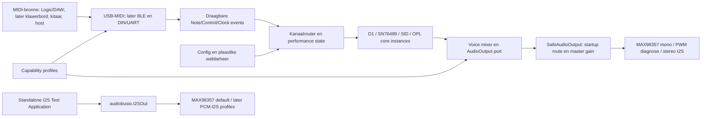

# Framework And Solution Architecture

<!--
Bestand: architecture_v0.1.0.md
Versienommer: 0.3.0
Doel: Beskryf framework-, solution-, runtime- en deployment-argitektuur met afdwingbare grense.
Sprint: Sprint 2
Epic: MCP-EPIC-009 Framework Engineering
User-Story: MVP-SCOPE-REDUCTION-001, MCP-US-016 en MCP-US-075
Actienr: MCP-ACT-075-ARCH-001
ChatID: CHATOD-20260714-MCP-CP-MVP-001 / MCP-US-075-START
-->

## Argitektuurlense

| Lens | Fokus | Bron van waarheid |
|---|---|---|
| Enterprise | Waarde, vermoëns, rolle en portefeuljevolgorde | Visie, stories, RACI |
| Framework | Artefakte, gesag, review en agentkonteks | Hierdie pakket en `AGENTS.md` |
| Solution | Komponente, poorte en runtime-grense | ADR's, bronkode en kontraktoetse |
| Deployment | Host, CIRCUITPY, USB-MIDI, I2S en latere netwerk | HIL-runner en story-runbooks |

## Solution-konteks

Die standalone I2S-diagnoselaan is doelbewus nie aan `Application`, `SynthCore`, MIDI of die core registry gekoppel nie. Dit is 'n onafhanklike fisiese debug-instrument, nie 'n tweede synth-runtime nie.

## Verpligte poorte

| Poort | Verantwoordelikheid | Verbode kennis |
|---|---|---|
| `MidiInputPort` | Lewer genormaliseerde events | Synth core, audio device |
| Router | Kies kanaal/core instance | USB/BLE implementasiedetail |
| `SynthCore` | Verwerk events en lewer voices/samples | Fisiese I2S-penne |
| `AudioOutput` | Neem begrensde interleaved signed-16 mono/stereo PCM-blokke aan; mute/unmute lifecycle | MIDI-toestelnaam en fisiese I2S-penne |
| `SafeAudioOutput` | Dekoreer enige backend met startup mute en begrensde master gain | Synth-core, USB-MIDI en 'n vals headphone-/line-out-aanspraak |
| Configuration | Lewer openbare en private waardes via instances | Hardgekodeerde secrets |
| Capability profile | Rapporteer module-, pen- en bordvermoë | Produkbesluit op grond van bordnaam alleen |

## Runtime-eienaarskap

`Application` besit die composition root. Dit konstrueer klasse en spuit afhanklikhede in. Elke veranderlike toestand, insluitend aktiewe note, routerbindings, buffers, netwerkstatus en diagnostiektellers, behoort aan 'n instansie. Modules definieer klasse maar begin geen diens tydens import nie. `boot.py` doen slegs vroeë USB/platform-opstelling; `code.py` skep die application binne 'n main guard.

`device/i2s_test.py` het sy eie klein composition root en instansie-eienaarskap. Dit mag CircuitPython se audio-/boardmodules invoer, maar geen projek-synthpakket nie. Dit en die normale runtime kry nooit gelyktydig eienaarskap van I2S nie.

## Deployment-topologie

| Omgewing | Rol | Mag bewys |
|---|---|---|
| macOS/Windows/Linux host | Eenheid-, kontrak-, AST- en simulasiestoetse | Semantiek en draagbaarheid sonder fisiese claim |
| `CIRCUITPY` volume | Dependency-geslote firmwaremanifest | Gedeployde bron en libraries |
| Serial/REPL | Boot-, uitvoering-, heap- en statusbewys | Werklike toestelgedrag, geredigeer |
| Logic/DAW/CoreMIDI | USB-MIDI-stimulus | Host-na-toestel transport |
| MAX98357/luidspreker/ossilloskoop | Hoorbare en meetbare klank | Fisiese audio-uitvoer |
| Standalone `device/i2s_test.py` | G-C-D square-wave preflight | I2S, penne, voeding en versterker onafhanklik van D1 |
| Latere Wi-Fi station/AP | Plaaslike beheer | Netwerk-UI, nie bootkritieke synthlogika nie |

## Cross-cutting kwaliteit

- **Portabiliteit:** capability gate plus tweede-bordbewys.
- **Sekuriteit:** private settings buite Git; AP met wagwoord; geen UID/MAC in openbare logs.
- **Prestasie:** begrensde polls, voorafbegrote buffers, heap/latency/dropout-telemetrie.
- **Herstelbaarheid:** CIRCUITPY bly bereikbaar; een serial-eienaar; atomiese deploy; safe boot.
- **Naspeurbaarheid:** story, ChatID, weergawe en release-datum in kodeheaders en startup.

## Evolusievolgorde

Die bindende oorblywende MVP-volgorde is `US-075 -> US-055 -> US-057`; US-005, US-014, US-016 en US-063 is gesluit. US-075 beveilig die fisiese las/volume; US-055 bewys daarna die volle Logic-na-klankvloei. SN76489 en alle ander kerne, webbeheer, BLE, multi-core, DSP en USB-instance-polish volg ná die MVP.

## Argitektuurfitness

Die AST-suite toets geen globals/modulefunksies/import-newe-effekte. Kontraktoetse toets poorte. HIL toets deploy, USB en audio. Backlog-sanity toets unieke stories en dekking. ADR-review is verpligtend wanneer 'n verandering 'n poort, bordstrategie, audio-backend, security boundary of releaseclaim verander.
